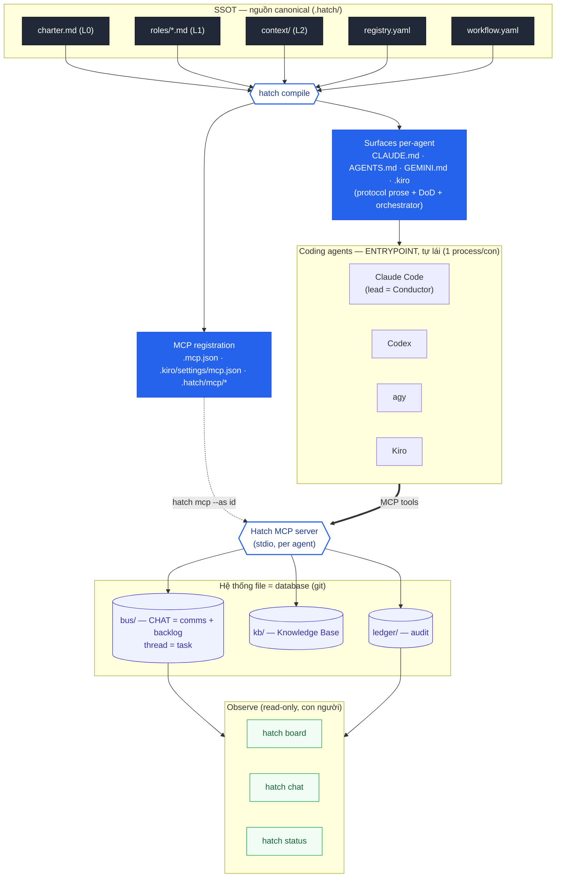
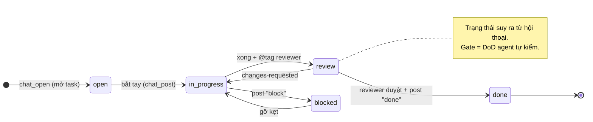

# Sơ đồ kiến trúc & workflow

> **Mô hình embedded-harness** (xem [doc 20](20-embedded-harness-pivot.md)). Coding agent là entrypoint và **tự lái**; Hatch là lớp nền chung (chat = comms + backlog, KB, ledger) mà agent với tới **qua MCP**. Hatch **không** spawn/điều khiển agent.

Bản plaintext là chính (đọc thẳng trong terminal/diff). Khối Mermaid bên dưới cho bản render trên GitHub.

## 1. Kiến trúc hệ thống (plaintext)

```
                       .hatch/  —  SINGLE SOURCE OF TRUTH
      ┌────────────────────────────────────────────────────────────────┐
      │ charter.md(L0)   roles/*.md(L1)   context/(L2)                   │
      │ registry.yaml (ai giữ vai gì)     workflow.yaml (quy trình)      │
      └─────────────────────────────┬──────────────────────────────────-┘
                                    │  hatch compile
                                    ▼
      ┌──────────────────────────────────────┐   ┌──────────────────────────┐
      │ SURFACES (per-agent, sinh ra)         │   │ MCP REGISTRATION (sinh ra)│
      │ CLAUDE.md · AGENTS.md · GEMINI.md     │   │ .mcp.json (Claude)        │
      │ .kiro/steering/                       │   │ .kiro/settings/mcp.json   │
      │ = protocol PROSE: workflow + chat     │   │ .hatch/mcp/*  (codex, agy)│
      │   etiquette + DoD self-check          │   └────────────┬──────────────┘
      │   (+ khối Orchestrator cho lead)      │                │ "chạy: hatch mcp --as <id>"
      └───────────────────┬──────────────────┘                │
                          │ agent đọc khi khởi động           │
                          ▼                                    ▼
      ┌──────────────────────────────────────┐      ┌────────────────────────┐
      │ CODING AGENTS  (ENTRYPOINT, tự lái;   │      │   HATCH MCP SERVER      │
      │ mỗi con 1 process, KHÔNG chung RAM)   │─────►│  hatch mcp --as <id>    │
      │ Claude Code · Codex · agy · Kiro      │ MCP  │  (stdio, 1 instance/    │
      │  • lead = Conductor (mở thread/task)  │ tools│   agent, đúng danh tính)│
      └──────────────────────────────────────┘      └───────────┬─────────────┘
                                                                 │ đọc/ghi
                ┌────────────────────────────────────────────────┘
                ▼
      ┌─────────────────────────────────────────────────────────────────┐
      │                 HỆ THỐNG FILE = DATABASE  (git)                   │
      │  bus/   = CHAT  →  comms + BACKLOG  (1 thread = 1 task)           │
      │           channel · thread · @mention · search · inbox           │
      │  kb/    = Knowledge Base  (đọc & GHI chung: decision/learning)    │
      │  ledger/= append-only audit (who/what/why)                       │
      └─────────────────────────────────────────────────────────────────┘
                ▲ read-only
                │
      ┌─────────────────────────────────────┐
      │ OBSERVE (con người xem, không lái)   │   hatch msg  ──► chèn ý kiến vào chat
      │ hatch board · hatch chat · hatch status   (read-only views)      │
      └─────────────────────────────────────┘

  Ba kho tri thức:  SSOT = config VÀO  ·  KB = tri thức VÀO+RA  ·  ledger = sự kiện RA
  (Archived sau -tags hatch_legacy: orchestrator spawn · workflow-engine · ceremonies…)
```

## 2. Vòng đời một task = một thread chat (quy ước, KHÔNG phải engine)

```
   chat_open               chat_post (tiến độ)        @tag reviewer        chat_post "done"
   ┌────────┐   bắt tay    ┌─────────────┐  xong việc  ┌────────┐  duyệt   ┌──────┐
   │  OPEN  │ ───────────► │ IN-PROGRESS │ ──────────► │ REVIEW │ ───────► │ DONE │
   └────────┘  (mở task)   └─────────────┘             └────────┘          └──────┘
                                 │  ▲                       │
                       post      │  │ gỡ kẹt                │ changes-requested
                      "block"    ▼  │ (post tiếp)           │ (@tag lại tác giả)
                            ┌─────────┐ ◄───────────────────┘
                            │ BLOCKED │
                            └─────────┘
   • Trạng thái SUY RA từ hội thoại (post type done/block/decision) — không có lane-engine.
   • workflow.yaml chỉ là PROSE hướng dẫn (đã compile vào CLAUDE.md…); ai làm vai gì theo đó.
   • Gate = Definition-of-Done agent TỰ chạy & xác nhận (make test/lint, no-self-review, human-merge).
```

## 3. Một vòng trao đổi giữa agent (qua MCP + bus)

```
  Conductor (Claude)              Hatch bus (#export-csv)            Codex
        │  chat_open "Export CSV   │                                  │
        │   @codex stream giúp" ──► │  thread tạo, @codex vào "To"     │
        │                          │ ◄── chat_inbox ─────────────────-┤ (đầu session)
        │                          │     thấy @mention                 │
        │                          │ ◄── chat_read #export-csv ───────-┤ hiểu nhiệm vụ
        │                          │            code + test            │
        │                          │ ◄── chat_post "PR #42, @claude    │
        │ ◄── chat_inbox ──────────┤     review" (reply_to=root) ──────┘
        │  đọc, REVIEW (≠ tác giả) │
        │  kb_add "ADR: streaming" │  (tri thức đáng giữ → KB)
        │  chat_post "done" ──────► │  thread khép (trạng thái: done)
        ▼                          ▼
  (không ai spawn ai — mọi trao đổi bất đồng bộ, agent trả lời khi đang chạy)
```

---

## Bản Mermaid (render trên GitHub)




