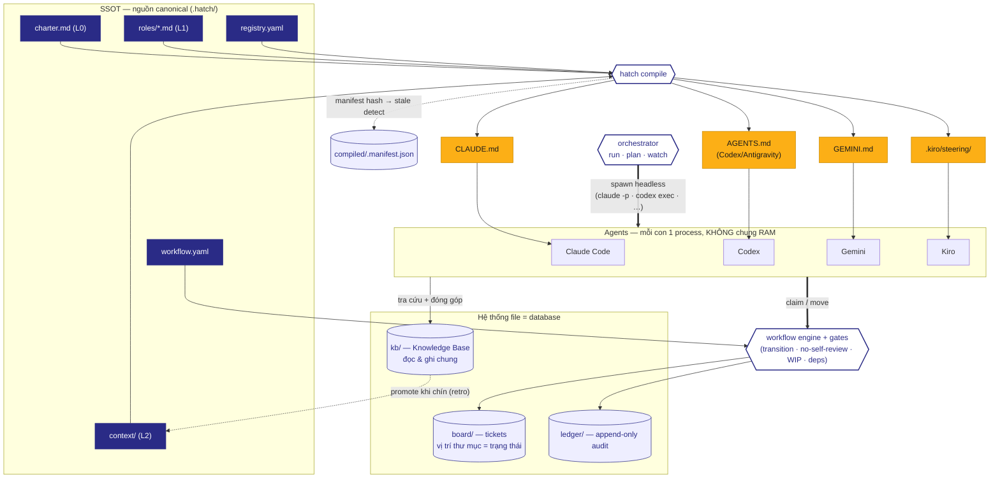
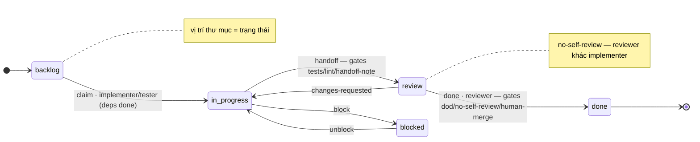
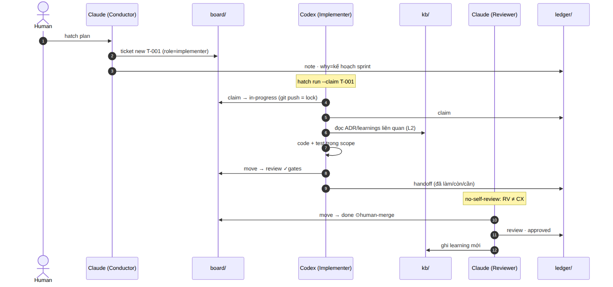
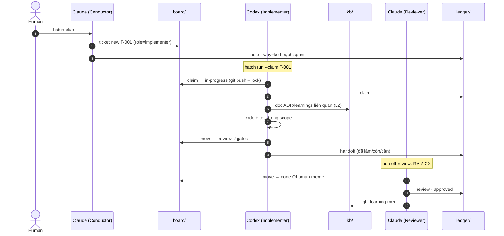

# Sơ đồ kiến trúc & workflow

Ba góc nhìn của Hatch. Khối Mermaid render trực tiếp trên GitHub; ảnh PNG tương ứng nằm trong `assets/`.

## 1. Kiến trúc hệ thống

SSOT compile xuống từng surface agent; agents điều phối qua board/ledger; KB là bộ nhớ chung đọc-ghi; orchestrator spawn agent headless.

## 2. Workflow — máy trạng thái ticket (template `scrum`)

Lane = thư mục trong `board/`. Mỗi mũi tên là một transition do `workflow.yaml` định nghĩa; nhãn ghi rõ ai được làm + gate phải qua.

## 3. Vòng đời một ticket (sequence)

Conductor lập kế hoạch → Implementer claim & làm → gate → Reviewer duyệt. Mọi bước để lại ledger; tri thức vào KB.

