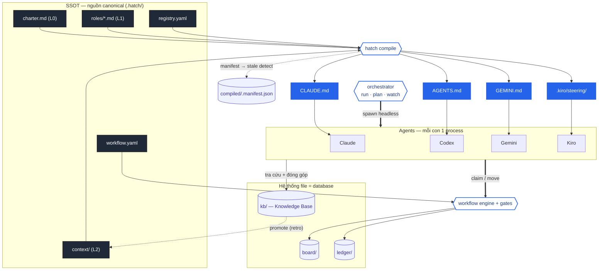
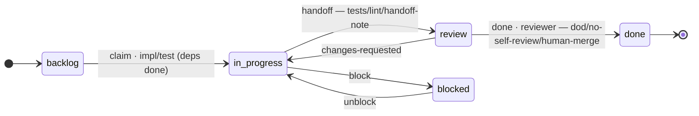

# Sơ đồ kiến trúc & workflow

Bản plaintext là chính (đọc thẳng trong terminal/diff). Khối Mermaid bên dưới cho bản render trên GitHub.

## 1. Kiến trúc hệ thống (plaintext)

```
                         .hatch/  —  SINGLE SOURCE OF TRUTH
        ┌──────────────────────────────────────────────────────────┐
        │ charter.md(L0)  roles/*.md(L1)  context/(L2)               │
        │ registry.yaml(ai giữ vai gì)    workflow.yaml(quy trình)   │
        └───────────────┬──────────────────────────┬─────────────────┘
                        │ hatch compile             │ workflow.yaml
                        ▼                            ▼
        ┌──────────────────────────────┐   ┌────────────────────────────┐
        │ SURFACES (per-agent, sinh ra) │   │  WORKFLOW ENGINE + GATES    │
        │ CLAUDE.md  AGENTS.md          │   │  transition · WIP · deps    │
        │ GEMINI.md  .kiro/steering/    │   │  no-self-review · gates     │
        │  (+ compiled/.manifest.json)  │   └──────────────┬──────────────┘
        └───────────────┬───────────────┘                  │ authorise
                        │ nạp L0+L1+con trỏ L2              │
                        ▼                                   │
        ┌──────────────────────────────┐   claim/move      │
        │ AGENTS (mỗi con 1 process,    │◀──────────────────┘
        │ KHÔNG chung RAM)              │
        │ Claude · Codex · Gemini · Kiro│
        └───┬───────────────┬───────────┘
   spawn ▲  │ claim/move    │ tra cứu + đóng góp
headless │  ▼               ▼
 ┌───────┴──────┐   ┌───────────────────────────────────────────────┐
 │ ORCHESTRATOR │   │           HỆ THỐNG FILE = DATABASE             │
 │ run·plan·    │   │  board/  (vị trí thư mục = trạng thái ticket)  │
 │ watch        │   │  ledger/ (append-only audit: who/what/why)     │
 └──────────────┘   │  kb/     (Knowledge Base — đọc & GHI chung)     │
                    └───────────────────────────────────────────────┘
                          kb/ ──promote khi chín (retro)──► context/ (SSOT)

  Ba kho tri thức:  SSOT = config VÀO  ·  KB = tri thức VÀO+RA  ·  ledger = sự kiện RA
```

## 2. Workflow — vòng đời ticket (plaintext, template `scrum`)

```
   ┌─────────┐  claim   ┌─────────────┐  handoff   ┌────────┐  done   ┌──────┐
   │ backlog │ ───────► │ in-progress │ ─────────► │ review │ ──────► │ done │
   └─────────┘ impl/test└─────────────┘ gates:     └────────┘ reviewer└──────┘
                  ▲           │ │        tests·lint·    │      gates: dod·
        unblock   │     block │ │        handoff-note   │      no-self-review·
                  │           ▼ │                       │      human-merge
              ┌─────────┐      │ └───────────────────────┘
              │ blocked │◀─────┘   changes-requested (review → in-progress)
              └─────────┘
   (lane = thư mục trong board/ · mỗi mũi tên = transition trong workflow.yaml)
```

## 3. Vòng đời một ticket qua các agent (plaintext)

```
  Human ── hatch plan ─► Conductor(Claude) ── ticket new T-001 ─► board/ + ledger(note)
                                                                       │
  Implementer(Codex) ── hatch run --claim T-001 ─► claim (git push = lock) ─► ledger(claim)
        │  đọc kb/ (ADR/learnings, L2)  ──►  code + test trong scope
        └─ move → review  [gates: tests·lint·handoff] ─► ledger(handoff: đã làm/còn/cần)
                                                                       │
  Reviewer(Claude ≠ Codex) ── move → done [no-self-review · human-merge] ─► ledger(approved)
                                          └─ ghi learning mới ─► kb/
```

---

## Bản Mermaid (render trên GitHub)




